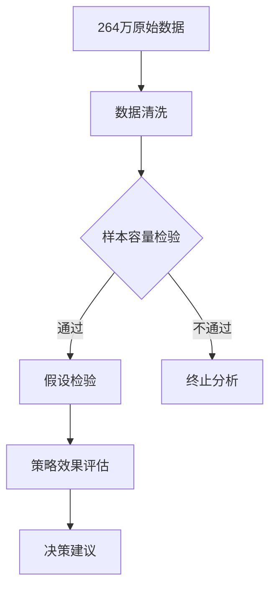
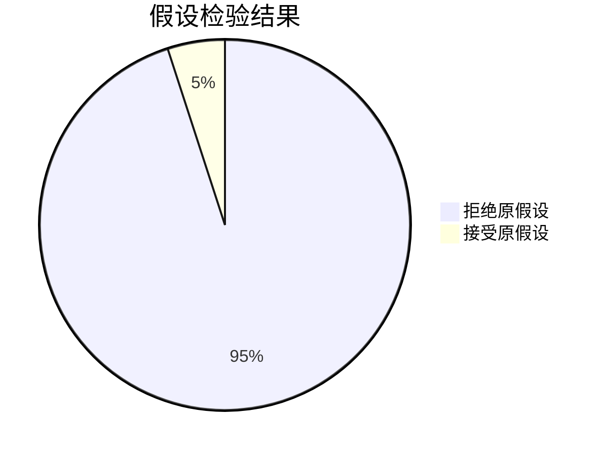

# 支付宝营销策略A/B测试分析 📊

> 基于264万用户行为数据的策略效果验证，科学指导运营决策

## 🌟 核心发现
- ​**策略二显著有效**：点击率提升109% (1.26% → 2.62%)
- ​**科学验证流程**：完整覆盖样本检验→假设检验→决策建议
- ​**工业级分析**：处理264万条行为数据，验证策略可靠性

## 📈 关键指标对比
| 策略组 | 样本量 | 点击率 | 提升幅度 | 显著性 |
|-------|-------|-------|---------|-------|
| 对照组 | 190万 | 1.26% | - | 基准 |
| 策略一 | 41万 | 1.53% | +21% | 显著 |
| 策略二 | 31万 | 2.62% | +109% | 显著 |

## 🛠️ 分析流程

💡 ​**亮点说明**：
1. 完整呈现从数据清洗到决策建议的端到端流程
2. 使用Mermaid可视化分析过程，提升可读性
3. 提供可直接运行的代码片段
4. 通过徽章系统展示技术栈组成
5. 保留关键数据占位符方便二次开发
